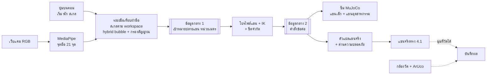
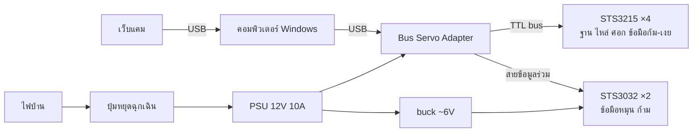

# การพัฒนาระบบควบคุมแขนกลผ่านกล้อง
**Development of a Camera-Based Robotic Arm Control System**

รุ่น 3.3 · 2026-11-02 · ฐานเนื้อหาสไลด์เสนออาจารย์ 8 หน้า คุยภายในทีมสัปดาห์นี้ก่อนเสนอจริง (B นำทำสไลด์ ทั้งทีมคิดร่วม) · เนื้อหาตัดสินโดยโรล C (D01, D27, D31, D33–D35, D40–D42) ผู้ทำสไลด์จัดรูปแบบได้ ถ้าจะเปลี่ยนเนื้อหาให้คุยกับ C ก่อน

**ไม่ขึ้นสไลด์:** งบและราคา, ผลวัดกล้องรอบแรก, การตัด AI, โค้ดทดลอง TensorFlow (D27, D31, D41) · **ห้ามอ้าง:** รองรับทุกแขน, ดีกว่าจอย, ภาพจำลองเป็นผลการทดลอง (D32)

## สไลด์ 1 · หัวข้อ
- ไทย: การพัฒนาระบบควบคุมแขนกลผ่านกล้อง
- อังกฤษ: Development of a Camera-Based Robotic Arm Control System

## สไลด์ 2 · ภาพรวมและที่มา
ผู้ใช้ขยับมือหน้าเว็บแคม ระบบอ่านมือ แปลงเป็นเป้าหมายปลายแขน แล้วสั่งแขนกลให้หยิบบล็อกวางถาดและกดปุ่ม โดยไม่ต้องถือหรือสวมอุปกรณ์

การควบคุมแขนกลด้วยจอยสติ๊ก ถุงมือเซนเซอร์ หรือแขนต้นแบบ มีข้อแลกเปลี่ยนด้านอุปกรณ์และการติดตั้ง

ความท้าทายหลักคือมือคนกับแขนกลมีสเกลไม่เท่ากัน มือขยับได้สบายในกรอบไม่กี่สิบเซนติเมตร แต่แขนกลแต่ละรุ่นมีพื้นที่ทำงานต่างกัน ระบบต้องแปลงการเคลื่อนไหวให้ไปตามสัดส่วน คุมได้ละเอียดตอนเข้าเป้า เคลื่อนที่ได้ไกลเมื่อต้องการ และสั่งงานได้ง่าย

## สไลด์ 3 · วัตถุประสงค์และขอบเขต
**วัตถุประสงค์**
1. พัฒนาระบบควบคุมแขนกลด้วยการติดตามตำแหน่งมือ การหมุนข้อมือ และท่านิ้วผ่านกล้อง RGB ตัวเดียว โดยหมุนเฉพาะแกนที่แขนแต่ละรุ่นทำได้
2. พัฒนาระบบแปลงสเกลการเคลื่อนไหวจากมือไปยังแขนกลต่างขนาด โดยใช้ส่วนประมวลผลมือและรูปแบบข้อมูลกลางร่วมกัน
3. ประเมินความแม่นยำและความง่ายในการสั่งงานของวิธีแปลงสเกล โดยเทียบการ mapping แบบ relative กับแบบ hybrid bubble

**ขอบเขต**
- กล้อง RGB หนึ่งตัว ผู้ใช้หนึ่งคน มือเดียว แสงและตำแหน่งกล้องคงที่ ปรับเทียบก่อนใช้งานได้
- แขนสองขนาด: แขนจริงขนาดเล็ก (ของจริงและในซิม) และแขนอุตสาหกรรมในซิม เช่น UR5e ยืนยันรุ่นหลังตรวจ MuJoCo บน Windows
- ระยะที่สอง ถ้าทันตามจุดตัดสินกลาง ก.พ.: มือหลายนิ้วในซิมที่คุมทีละนิ้ว

## สไลด์ 4 · วิธีการและโมเดล 3D
พูดวิธีการไปพร้อมโมเดลแขน

**คุมด้วยมือ** (ชุดเริ่มต้น จะล็อกหลัง gesture study, D40, D42)
| ผู้ใช้ทำ | แขนทำ |
|---|---|
| กด C | เริ่มตาม ก่อนกดแขนรอนิ่ง |
| ขยับมือซ้าย-ขวา ขึ้น-ลง | ปลายแขนตาม |
| ดันมือเข้า-ออกกล้อง | ระยะเอื้อม |
| ก้มและบิดข้อมือ | มุมก้าม เฉพาะแกนที่แขนทำได้ |
| กำมือ / แบมือ | ก้ามปิด / เปิด |
| กด Space แล้ว C | พักแล้วตามต่อโดยไม่กระโดด ใช้จัดมือกลับกลางได้ |

**แปลงสเกล**
- ระยะมือคิดเทียบขนาดฝ่ามือ → สเกลตาม workspace ของแขน → เป้าหมายปลายแขนหน่วยเมตร
- สเกล 1 = ขยับมือเต็มระยะแล้วแขนไปได้เต็ม workspace ของรุ่นนั้น เลือก 0.5 (ละเอียด), 1 หรือ 1.25 ได้
- Hybrid bubble: ในฟองคุมตำแหน่งแบบละเอียด นอกฟองแขนเลื่อนต่อตามทิศ มีเพดานความเร็ว และหยุดทันทีเมื่อมือหาย
- การหมุนข้อมือใช้แนวคิดเดียวกัน: บิดนิดเดียวแขนหมุนตามมุม บิดเกินช่วงแขนหมุนต่อเนื่องจนกว่ามือกลับกลาง

**งานทดสอบ:** เคลื่อนตามเป้าหมาย, หยิบบล็อก 4–5 ซม. วางในถาด, กดปุ่ม ~3 ซม.

**สื่อ** (คำบรรยาย: "ภาพจำลองจากโมเดล CAD เพื่ออธิบายวิธีการ ไม่ใช่ผลการควบคุมด้วยกล้อง และไม่ใช่การจำลองฟิสิกส์")
- [โมเดลแขน 3D](https://claude.ai/artifact/RYQY3PPRSpPc8iUWpzp848): หมุนดูแบบ CAD ปัจจุบัน
- [Arm Motion Test](https://claude.ai/artifact/Euzztz8f5QUUmUJ4CAmUJE): มูฟงานบนแขนปัจจุบัน
- วิดีโอมือจริงคุมแขนจำลองบนจอ (mock arm): ใส่ถ้าอัดทัน ต้องติดป้ายว่าไม่ใช่แขนจริง

## สไลด์ 5 · System design
ผู้ทำสไลด์วาดใหม่ได้ แต่ลำดับกล่องและชื่อต้องคงตามนี้

```mermaid
flowchart LR
  CAM[เว็บแคม RGB] --> MP[MediaPipe<br/>จุดมือ 21 จุด]
  KEY[ปุ่มบนคอม<br/>เริ่ม พัก สเกล] --> MAP
  MP --> MAP[ระยะมือเทียบฝ่ามือ<br/>สเกลตาม workspace<br/>hybrid bubble + กรองสัญญาณ]
  MAP --> T1[[ข้อมูลกลาง 1<br/>เป้าหมายปลายแขน หน่วยเมตร]]
  T1 --> IK[โปรไฟล์แขน + IK<br/>+ ขีดจำกัด]
  IK --> T2[[ข้อมูลกลาง 2<br/>คำสั่งข้อต่อ]]
  T2 --> SIM[ซิม MuJoCo<br/>แขนเล็ก + แขนอุตสาหกรรม]
  T2 --> DRV[ตัวแปลแขนจริง<br/>+ ด่านความปลอดภัย]
  DRV --> ARM[แขนจริงทรง 4.1]
  ARM -. มุมที่วัดได้ .-> LOG[บันทึกผล]
  ARU[กล้องวัด + ArUco] -.-> LOG
```

- **ข้อมูลกลาง** ทำให้ส่วนมือไม่ต้องรู้จักแขน เพิ่มแขนรุ่นใหม่ = เพิ่มโปรไฟล์ + ตัวแปล
- **หยุดสองชั้น** (D30): คำสั่งพักหรือมือหาย = แขนค้างท่า; ปุ่มหยุดฉุกเฉิน = ตัดไฟมอเตอร์
- **แบ่งงานตามเลน** (D23): A มือ → เป้าหมาย · B เป้าหมาย → ซิม · C ข้อมูลกลาง + แขนจริง

## สไลด์ 6 · แขนจริงและอุปกรณ์
**แขนจริง**
- CAD ของทีมเอง ทรง FABRI Brazo Robótico 4.1 (วาดเองจากภาพสาธารณะ ไม่ใช้ไฟล์ผู้ขาย) บนจลนศาสตร์ SO-101 แบบเปิด (Apache-2.0) 5 แกน + ก้ามหนีบ พิมพ์ 3D ประกอบเอง ฐานกลมหมุนรอบวง ±180° เก็บชิ้น SO-101 เป็นแผนสำรอง
- ระยะเอื้อมคำนวณ ≈ 42 ซม. จากแกนไหล่ (ยังไม่วัดจริง)
- Bus servo อ่านมุมกลับได้ทั้ง 6 ข้อ: Feetech STS3215 12V ×4 ที่ฐาน ไหล่ ศอก ข้อมือก้ม-เงย + STS3032 6V ×2 ที่ข้อมือหมุนและก้าม
- ภาพ: `cad/shell_v1/renders/ready_front34.png`, `ready_back34.png`, `zero_side.png` คำบรรยาย "แบบ CAD ยังไม่ได้พิมพ์หรือประกอบจริง"

**การต่อฮาร์ดแวร์**

```mermaid
flowchart LR
  CAM[เว็บแคม] -- USB --> PC[คอมพิวเตอร์ Windows]
  PC -- USB --> BUS[Bus Servo Adapter]
  BUS -- TTL bus --> STS[STS3215 ×4<br/>ฐาน ไหล่ ศอก ข้อมือก้ม-เงย]
  BUS -- สายข้อมูลร่วม --> S32[STS3032 ×2<br/>ข้อมือหมุน ก้าม]
  AC[ไฟบ้าน] --> ES[ปุ่มหยุดฉุกเฉิน] --> PSU[PSU 12V 10A]
  PSU --> BUS
  PSU --> BUCK[buck ~6V] --> S32
```
วิธีแยกไฟ 6V ของ STS3032 ยังไม่ล็อก ผังนี้เป็นแนวทางปัจจุบัน (D33, D35)

**เครื่องมือ** ✅ เลือกแล้ว · 🔄 กำลังตรวจหรือเลือก

| ฮาร์ดแวร์ | ใช้ทำอะไร | สถานะ |
|---|---|---|
| เว็บแคม RGB ทั่วไป 1 ตัว | อ่านมือผู้ใช้ | ✅ |
| คอมพิวเตอร์ Windows (ASUS) และ MacBook M1 | รันระบบและซิม (ASUS) · พัฒนาโค้ด (M1) | ✅ |
| เครื่องพิมพ์ 3D (bed ≥ 220×220 มม.) | พิมพ์ชิ้นแขนและฐาน | ✅ |
| STS3215 12V ×4, STS3032 6V ×2 | ขับข้อต่อ | ✅ |
| Waveshare Bus Servo Adapter (A) | สั่งและอ่านมุม bus servo | ✅ |
| PSU 12V 10A + buck ~6V, ฟิวส์, ปุ่มหยุดฉุกเฉิน | จ่ายไฟและตัดไฟฉุกเฉิน | ✅ |
| ArUco marker + กล้องวัด | วัดตำแหน่งปลายแขนจริงจากภายนอก | ✅ |

| ซอฟต์แวร์ | ใช้ทำอะไร | สถานะ |
|---|---|---|
| Python | ภาษาหลักของทุกส่วน | ✅ |
| MediaPipe | ตรวจจับจุดมือ 21 จุด (โมเดลสำเร็จรูป) ส่วนการแปลงการเคลื่อนไหวเป็นวิธีคำนวณ | ✅ |
| OpenCV + NumPy | อ่านภาพ ปรับเทียบกล้อง อ่าน ArUco คำนวณ | ✅ |
| MuJoCo | ซิมแขนสองขนาดและการสัมผัสวัตถุ | ✅ เลือกแล้ว รอตรวจบน Windows (D39, P001) |
| ไลบรารี IK | แปลงเป้าหมายปลายแขนเป็นมุมข้อต่อ | 🔄 B เลือก |
| ไลบรารีคุม bus servo | สั่งและอ่านมุม STS3215 และ STS3032 | 🔄 C เลือก |
| dex-retargeting | แปลงท่านิ้วไปมือหลายนิ้ว (ระยะที่สอง) | 🔄 ถ้าทัน |
| FreeCAD + slicer | ออกแบบตัวแขน ฐาน ที่ยึดมอเตอร์ เตรียมไฟล์พิมพ์ | ✅ |
| Git, GitHub, GitHub Actions | เก็บโค้ด ทำงานร่วมกัน ทดสอบอัตโนมัติ | ✅ |

## สไลด์ 7 · การประเมินผลและผลที่คาดว่าจะได้รับ
**ประเมินผล:** วัดความแม่นยำแยก 4 ชั้น ได้แก่ ความซ้ำได้ของแขนเอง, ความนิ่งของเป้าหมายจากกล้อง, ความคลาดเคลื่อนปลายแขนทั้งระบบ และอัตราสำเร็จของงาน พร้อมเวลาทำงาน ความต่อเนื่อง ความหน่วง และ Fitts' law throughput เทียบ mapping สองแบบภายใต้เงื่อนไขเดียวกัน รายงานผลในซิมและบนแขนจริงแยกกัน เกณฑ์ผ่านเชิงตัวเลขตั้งหลังรอบ pilot (มี.ค.) จากข้อมูลจริง

**ผลที่คาด:** ระบบต้นแบบที่ใช้มือเดิมคุมแขนกลต่างขนาดได้ผ่านกล้อง พร้อมผลทดลองที่แสดงว่าวิธีแปลงสเกลช่วยเรื่องความแม่นยำและความง่ายได้แค่ไหน และข้อจำกัดที่พบ

## สไลด์ 8 · เวลา ความเสี่ยง และความเห็นที่ขอ
✓ เสร็จแล้ว · ● กำลังทำ (ณ 2 พ.ย. 2569) · ○ ตามแผน · ★ จุดส่งงาน

| การดำเนินงาน | ต.ค. | พ.ย. | ธ.ค. | ม.ค. | ก.พ. | มี.ค. | เม.ย. |
|---|:-:|:-:|:-:|:-:|:-:|:-:|:-:|
| เตรียมข้อเสนอ ปรึกษาอาจารย์ กำหนดขอบเขต | ✓ | ● | | | | | |
| ออกแบบระบบ รูปแบบข้อมูลกลาง และแบบแขนจริง | ✓ | ● | | | | | |
| พัฒนาระบบกล้องและการแปลงการเคลื่อนไหว | | ● | ○ | ○ | | | |
| สร้างซิมแขนสองขนาด | | ○ | ○ | ○ | | | |
| จัดหาชิ้นส่วน ประกอบแขนจริง และระบบควบคุมมอเตอร์ | | ○ | ○ | ○ | | | |
| รวมระบบ ทดสอบหยิบ–วางและกดปุ่ม ส่งความคืบหน้า | | | ○ | ★ | | | |
| มือหลายนิ้วในซิม (ระยะที่สอง ถ้าทัน) | | | | | ○ | | |
| วัดผลด้วยกล้องวัด ทดลองนำร่อง และล็อกวิธีทดลอง | | | | | ○ | ○ | |
| เก็บผลหลัก วิเคราะห์ ทำรายงานและส่งงาน | | | | | | | ★ |

**ส่งความคืบหน้า ม.ค. 2570:** หยิบ–วางในซิมทั้งสองแขนด้วยมือจริง พร้อมตัวเลขชุดแรก · เป้าหมายเพิ่ม: แขนจริงขยับได้ ขึ้นกับการจัดหาชิ้นส่วน (D41)
**ส่งงานทั้งหมดปลาย เม.ย. 2570** ไม่มีเวลาสำรอง ถ้างานช้าตัดจากท้าย: มือหลายนิ้วหยิบบล็อก → มือหลายนิ้วทั้งหมด → โหมด Z แยก

**ความเสี่ยง**
| ความเสี่ยง | รับมือ |
|---|---|
| กล้องตัวเดียวอ่านระยะลึกคลาดเมื่อท่ามือเปลี่ยน | ชดเชยจากเรขาคณิตมือ, ค้างเป้าหมายช่วงเปลี่ยนท่า, โหมด Z แยกเป็นทางสำรอง |
| การอ่านมุมบิดข้อมือ | วัดซ้ำบนเครื่องทดลอง, หาวิธีอ่านใหม่ หรือคุมก้มกับบิดคนละจังหวะ |
| ความหน่วงทั้งระบบทำให้โซนนอกฟองเลยเป้า | วัดก่อนจูนฟอง และมีเพดานความเร็ว |
| แขนจริงมาช้า | แฝดซิมและ fake servo ทำงานแทนระหว่างรอ |

**ความเห็นที่ขอจากอาจารย์**
1. ขอบเขตแขนสองขนาดและงานทดสอบเหมาะสมไหม
2. วิธีประเมิน 4 ชั้นและการเทียบ mapping สองแบบเพียงพอไหม

## เตรียมตอบ (ไม่ขึ้นสไลด์)
- **ใช้ AI ไหม:** MediaPipe เป็นโมเดลอ่านมือสำเร็จรูป ส่วนการแปลงการเคลื่อนไหวเป็นวิธีคำนวณ เราไม่ได้ฝึกโมเดลเอง
- **ทำอะไรไปแล้ว:** ต้นแบบอ่านมือบนกล้องจริง, รูปแบบข้อมูลกลางพร้อมเทสต์, CAD แขนและการทดสอบมูฟเชิงเรขาคณิต ทั้งหมดยังไม่มีการขยับแขนจริงหรือซิมฟิสิกส์
- **ผลวัดกล้องรอบแรก:** ดู `docs/research/hardware-notes/2026-11-02-hand-axis-bench-results.md` มาจากคนเดียว เครื่องเดียว ยังไม่ใช่ค่าของทีม
